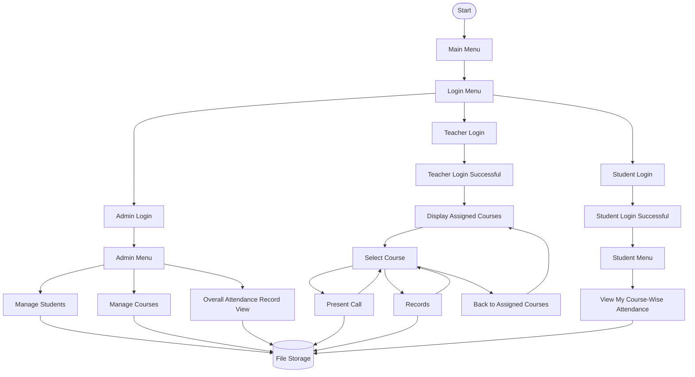

# 📚 Smart Attendance System

A menu-driven **Smart Attendance System developed in C** for the CSE 1102 Structured Programming Lab at Khulna University of Engineering & Technology (KUET).

The system provides separate access for administrators, teachers, and students. It supports student registration, assigned-course workflows for teachers, attendance tracking, course-wise student attendance reports, and file-based data management.

## 🎯 Project Overview

Managing attendance manually can be time-consuming, particularly when students attend multiple courses. This project aims to simplify attendance management through a modular C application with role-based menus and persistent file storage.

The system separates administrative tasks, teacher attendance operations, and student record viewing to provide a clear and organized workflow.

## ✨ Features

### 🛡️ Admin Module

The Admin Menu provides the following options:

1. **Manage Students** — access student management functionality.
2. **Manage Courses** — access course management functionality.
3. **Overall Attendance Record View** — view the overall attendance report.
4. **Logout** — exit the administrator session.

### 👨‍🏫 Teacher Module

Teachers log in using their teacher credentials and select from their assigned courses.

**Teacher workflow:**

1. Teacher Login
2. Display assigned courses
3. Select a course
4. Choose an operation:

   * **Present Call** — take attendance for the selected course.
   * **Records** — access attendance records.
   * **Back to assigned courses** — return to the course list.

This course-based workflow allows teachers to work within the context of a specific assigned course instead of selecting from an unrestricted course list.

### 🎓 Student Module

Students log in using their roll number and password. After successful authentication, the system welcomes the student by name.

The Student Menu provides:

* **Records** — display the student's course-wise attendance.
* **Exit** — leave the student session.

The course-wise attendance report includes:

| Field       | Description                           |
| ----------- | ------------------------------------- |
| Course Code | Identifier of the course              |
| Course Name | Name of the course                    |
| Present     | Number of classes attended            |
| Total       | Total recorded classes                |
| Attendance  | Attendance percentage for that course |

The report identifies the logged-in student automatically, so the student does not need to enter their roll number again to view their own records.

### 📊 Course-Wise Attendance Reporting

The student report displays attendance separately for each course.

For example, a student may have different attendance percentages in Structured Programming, English and Human Communication Laboratory, and Differential and Integral Calculus.

Attendance is calculated using:

$$
\text{Attendance Percentage}
=
\frac{\text{Classes Attended}}{\text{Total Classes}}
\times 100
$$

The reporting module uses a **75% threshold** for low-attendance warnings where that check is applied.

### 📁 File-Based Data Management

The project uses text files to store and retrieve information, demonstrating file handling in C.

* Student registration and login information
* Course information
* Attendance records
* Course-wise attendance data used by the reporting workflow

## 🏗️ Architecture

The Smart Attendance System follows a modular, file-based architecture developed in C. The main application manages authentication and role-based navigation. Administrators can access student management, course management, and overall attendance reporting. Teachers can select their assigned courses to take attendance or view records, while students can access their personal course-wise attendance reports.

The system uses text files to store student information, teacher information, course details, teacher-course assignments, and course-specific attendance records. Separate C source and header files organize the application's features into reusable modules.


### System Workflow



### Main Components

| Component                 | Responsibility                                   |
| ------------------------- | ------------------------------------------------ |
| `src/main.c`              | Main menu, login flow, and role-based navigation |
| `features/REGISTRATION.c` | Student registration                             |
| `features/present.c`      | Attendance-taking functionality                  |
| `features/RECORD.c`       | Attendance records and reporting                 |
| `features/course.c`       | Course selection                                 |
| `features/*.h`            | Function declarations shared between modules     |
| `data/`                   | Text-file data storage                           |
| `.vscode/tasks.json`      | Automated multi-file compilation                 |
| `.vscode/launch.json`     | VS Code launch and debugging configuration       |

## 📂 Project Structure

```text
Smart-Attendance-System/
│
├── .vscode/
│   ├── launch.json
│   └── tasks.json
│
├── data/
│   ├── command.txt
│   ├── course-assignments.txt
│   ├── courses.txt
│   ├── CSE 1101-session.txt
│   ├── CSE 1101.txt
│   ├── HUM 1108-session.txt
│   ├── HUM 1108.txt
│   ├── logininputs.txt
│   ├── MATH 1107.txt
│   ├── student-new.txt
│   └── teacher.txt
│
├── features/
│   ├── course.c
│   ├── course.h
│   ├── managecourses.c
│   ├── managecourses.h
│   ├── present.c
│   ├── present.h
│   ├── RECORD.c
│   ├── record.h
│   ├── REGISTRATION.c
│   └── registration.h
│
├── src/
│   ├── main.c
│   └── previous/
│
├── .gitignore
└── README.md
```

### 📁 Directory Description

| Directory/File                | Purpose                                              |
| ----------------------------- | ---------------------------------------------------- |
| `src/main.c`                  | Main application, login system, and role-based menus |
| `features/course.c`           | Course selection                                     |
| `features/managecourses.c`    | Course management functionality                      |
| `features/present.c`          | Attendance-taking functionality                      |
| `features/RECORD.c`           | Attendance records and reporting                     |
| `features/REGISTRATION.c`     | Student registration                                 |
| `data/courses.txt`            | Course information                                   |
| `data/course-assignments.txt` | Teacher-course assignment information                |
| `data/teacher.txt`            | Teacher information                                  |
| `data/student-new.txt`        | Student information and login credentials            |
| `data/CSE 1101.txt`           | Attendance data for CSE 1101                         |
| `data/CSE 1101-session.txt`   | Session data for CSE 1101                            |
| `data/HUM 1108.txt`           | Attendance data for HUM 1108                         |
| `data/HUM 1108-session.txt`   | Session data for HUM 1108                            |
| `data/MATH 1107.txt`          | Attendance data for MATH 1107                        |
| `.vscode/tasks.json`          | Automated compilation of the project                 |
| `.vscode/launch.json`         | VS Code launch and debugging configuration           |


## 🧰 Technologies Used

* **Programming Language:** C
* **Compiler:** GCC / MinGW
* **IDE:** Visual Studio Code
* **Version Control:** Git and GitHub
* **Data Storage:** Text files
* **Build Automation:** VS Code Tasks
* **Debugging:** VS Code C/C++ debugger

## 🚀 Installation and Execution

### 1. Clone the Repository

```bash
git clone https://github.com/adilmahmudayon-hue/Smart-Attendance-System.git
cd Smart-Attendance-System
```

### 2. Compile the Project

Run this command from the project root directory:

```bash
gcc src/main.c features/REGISTRATION.c features/present.c features/RECORD.c features/course.c -Ifeatures -o attendance.exe
```

### 3. Run the Application

On Windows PowerShell:

```powershell
.\attendance.exe
```

### 4. Run Through Visual Studio Code

The project includes shared VS Code build and launch configurations.

1. Open the repository folder in VS Code.
2. Select **Run and Debug**.
3. Choose **Run Smart Attendance System**.
4. Click the green Start button.

The configured build task compiles the required source files before launching the application.

## 🧠 C Programming Concepts Demonstrated

* Functions and modular programming
* Conditional statements and loops
* Arrays and strings
* Pointers and function parameters
* File handling and persistent storage
* Input validation
* Role-based menu navigation
* Multi-file compilation and header files
* Attendance percentage calculations

## 🛣️ Future Improvements

* Extend administrative student and course management
* Add teacher management and course-assignment controls
* Improve attendance-record filtering and reporting
* Strengthen password storage and authentication
* Improve validation and error handling
* Add more detailed course-wise and overall summaries

## 🤝 Team Members

* **Adil Mahmud Ayon** — [@adilmahmudayon-hue](https://github.com/adilmahmudayon-hue)
* **Antora Ghosh** — [@agantoraghosh-prog](https://github.com/agantoraghosh-prog)
* **Mitaly Farzana Oishe** — [@mitalyoyshe](https://github.com/mitalyoyshe)

## 🔄 GitHub Collaboration

Pull the latest changes:

```bash
git pull origin main
```

After making changes:

```bash
git add .
git commit -m "Describe your changes"
git push origin main
```

Pull before starting shared work to reduce merge conflicts.

## 📄 License

See the [LICENSE](LICENSE) file for licensing information.

---

**Developed as a CSE 1102 Structured Programming Lab project at KUET.**
