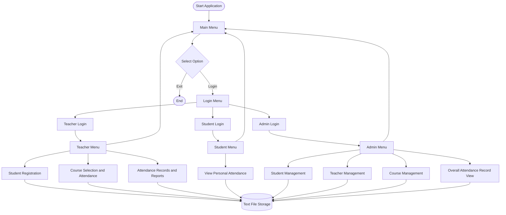

# 📚 Smart Attendance System

A menu-driven **Smart Attendance System developed in C** for the CSE 1102 Structured Programming Lab at Khulna University of Engineering & Technology (KUET).

The application provides role-based access for teachers, students, and administrators. It supports student registration, attendance tracking, attendance reports, percentage calculations, and file-based data management.

## 🎯 Project Overview

Traditional attendance management can be time-consuming and makes it difficult to maintain organized records. This project provides a simple, file-based solution using the C programming language.

The system follows a modular architecture, separating the main application flow from individual feature modules. This makes the project easier to understand, maintain, test, and extend.

## ✨ Features

### 👨‍🏫 Teacher Module

* Secure teacher login
* Register new students
* Select a course for attendance
* Mark student attendance
* View individual student attendance records
* Calculate attendance percentages
* Display attendance-status messages
* View overall class attendance reports

### 🎓 Student Module

* Log in using registered student credentials
* View personal attendance records
* Check classes attended and total classes
* View attendance percentage
* Receive a warning when attendance falls below the 75% threshold

### 🛡️ Admin Module

* Dedicated administrator login
* Admin dashboard with a menu-based interface
* Student management option
* Teacher management option
* Course management option
* Overall Attendance Record View
* Logout functionality

*Note: Student management, teacher management, and course management are menu options intended for further development.*

### 📚 Course Management and Attendance

* Display available courses from a course configuration file
* Select a course before taking attendance
* Support course-specific attendance storage as the system is extended
* Keep student and attendance information in text files

### 💾 File-Based Data Management

The application uses file handling in C to store and retrieve project data.

| File                   | Purpose                                                        |
| ---------------------- | -------------------------------------------------------------- |
| `data/student-new.txt` | Registered student information and login details               |
| `data/attendance.txt`  | Attendance records used by the current record-reporting module |
| `data/courses.txt`     | Available course codes and names                               |
| `data/logininputs.txt` | Login-related input data                                       |
| `data/command.txt`     | Project-related command/input information                      |

Additional course-specific attendance files may be created as the course-wise attendance implementation develops.

## 🏗️ Architecture

The application uses a modular, menu-driven C architecture. The main program handles navigation and authentication, feature modules perform registration and attendance operations, and text files provide persistent storage.

### System Workflow



### Architecture Components

| Component                 | Responsibility                                       |
| ------------------------- | ---------------------------------------------------- |
| `src/main.c`              | Main menu, authentication, and role-based navigation |
| `features/REGISTRATION.c` | Student registration                                 |
| `features/present.c`      | Attendance-taking functionality                      |
| `features/RECORD.c`       | Student attendance records and overall reporting     |
| `features/course.c`       | Course selection                                     |
| `features/*.h`            | Function declarations shared between modules         |
| `data/`                   | Text files used for persistent data storage          |
| `.vscode/tasks.json`      | Automated multi-file compilation                     |
| `.vscode/launch.json`     | VS Code debugging and execution configuration        |

## 🔄 Application Workflow

1. The user launches the application.
2. The user selects Login from the main menu.
3. The user chooses Teacher Login, Student Login, or Admin Login.
4. The system validates the supplied credentials.
5. The application displays the corresponding role-specific menu.
6. Teachers can register students, select courses, take attendance, and view reports.
7. Students can view their own attendance information.
8. Administrators can access the overall attendance report and the available management menus.
9. Data is read from or written to text files as required.

## 🧰 Technology Stack

* **Language:** C
* **Compiler:** GCC (MinGW on Windows)
* **IDE:** Visual Studio Code
* **Version Control:** Git and GitHub
* **Data Storage:** Text files
* **Build Automation:** VS Code Tasks
* **Debugging:** VS Code C/C++ debugger

## 📂 Project Structure

```text
Smart-Attendance-System/
│
├── .vscode/
│   ├── tasks.json
│   └── launch.json
│
├── data/
│   ├── attendance.txt
│   ├── command.txt
│   ├── courses.txt
│   ├── logininputs.txt
│   └── student-new.txt
│
├── features/
│   ├── present.c
│   ├── present.h
│   ├── RECORD.c
│   ├── record.h
│   ├── REGISTRATION.c
│   ├── registration.h
│   ├── course.c
│   └── course.h
│
├── src/
│   ├── main.c
│   └── previous/
│
├── .gitignore
├── LICENSE
└── README.md
```

*The tree describes the intended/current modular layout. Individual course attendance files may appear in `data/` as that functionality is implemented.*

## 🚀 Getting Started

### Prerequisites

Install the following tools:

* [Git](https://git-scm.com/downloads)
* [GCC / MinGW](https://www.mingw-w64.org/)
* [Visual Studio Code](https://code.visualstudio.com/)
* VS Code C/C++ extension

### 1. Clone the Repository

```bash
git clone https://github.com/adilmahmudayon-hue/Smart-Attendance-System.git
cd Smart-Attendance-System
```

### 2. Compile the Project

Run the following command from the repository root:

```bash
gcc src/main.c features/REGISTRATION.c features/present.c features/RECORD.c features/course.c -Ifeatures -o attendance.exe
```

### 3. Run the Application

On Windows PowerShell:

```powershell
.\attendance.exe
```

### 4. Build and Run Through VS Code

The repository includes VS Code build and launch configurations.

1. Open the project folder in VS Code.
2. Select **Run and Debug** from the sidebar.
3. Choose **Run Smart Attendance System**.
4. Click the green Start button.
5. The build task compiles the required C source files before launching the program.

**Important:** Close any running instance of `attendance.exe` before rebuilding if Windows reports a permission error.

## 🔐 Login and Access

The application provides three separate login paths:

| Role    | Access                                                   |
| ------- | -------------------------------------------------------- |
| Teacher | Student registration, attendance-taking, and reports     |
| Student | Personal attendance records                              |
| Admin   | Overall attendance reporting and management menu options |

Use the credentials configured in the current source code. For a shared or public deployment, replace demonstration credentials with a safer authentication approach. Do not publish real passwords in the README.

## 📊 Attendance Calculation

Attendance percentage is calculated using:

$$
\text{Attendance Percentage}
=
\frac{\text{Classes Attended}}{\text{Total Classes}}
\times 100
$$

The current reporting logic uses a **75% threshold** to determine whether a student's attendance is low.

## 🧠 C Programming Concepts Demonstrated

This project applies core concepts from the Structured Programming Lab:

* Functions and modular programming
* Conditional statements and loops
* Arrays and strings
* Pointers and function parameters
* File handling for persistent storage
* Input validation and menu-driven interaction
* Structures of related modules through header files
* Basic authentication and role-based navigation

## 🛣️ Future Improvements

* Complete student management for administrators
* Implement teacher management
* Implement course management
* Complete course-wise attendance reporting
* Improve input validation and error handling
* Strengthen credential storage and authentication
* Add more detailed attendance summaries
* Improve the console interface and user experience

## 🤝 Team Members

* **Adil Mahmud Ayon** — [@adilmahmudayon-hue](https://github.com/adilmahmudayon-hue)
* **Antora Ghosh** — [@agantoraghosh-prog](https://github.com/agantoraghosh-prog)
* **Mitaly Farzana Oishe** — [@mitalyoyshe](https://github.com/mitalyoyshe)

## 🌿 Collaboration Workflow

To download the latest changes:

```bash
git pull origin main
```

After making your changes:

```bash
git add .
git commit -m "Describe your changes"
git push origin main
```

Always pull the latest changes before beginning shared work, and coordinate with teammates to reduce merge conflicts.

## 📄 License

See the [LICENSE](LICENSE) file for the project's licensing information.

---

**Developed as a CSE 1102 Structured Programming Lab project at KUET.**
